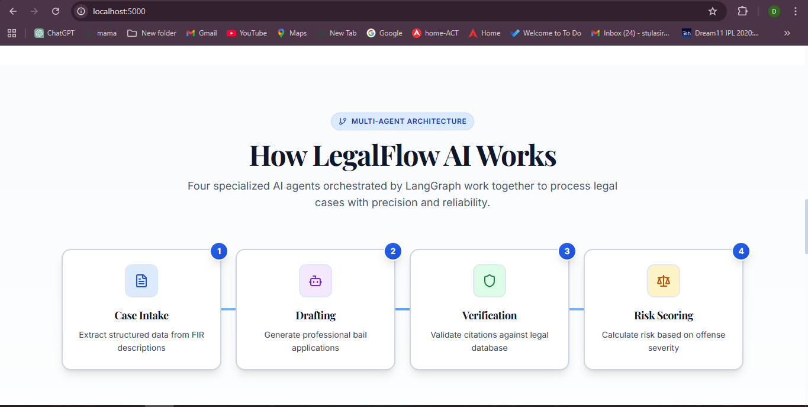
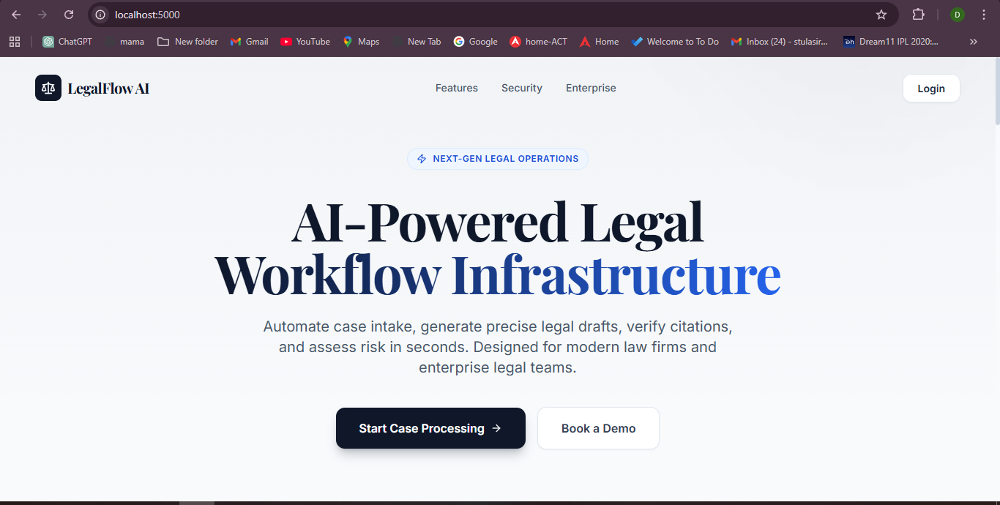
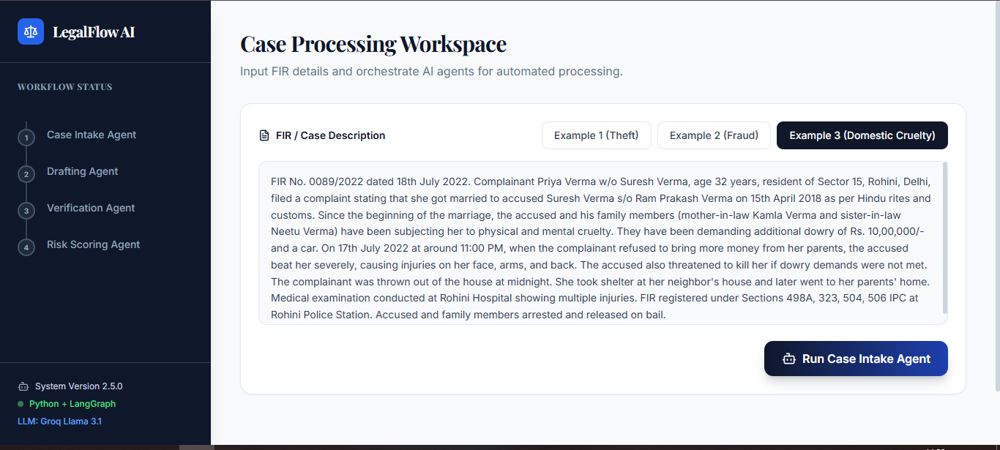
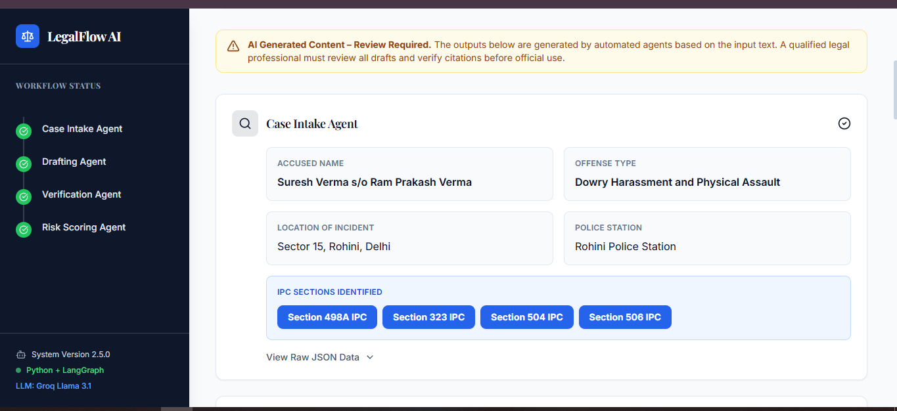
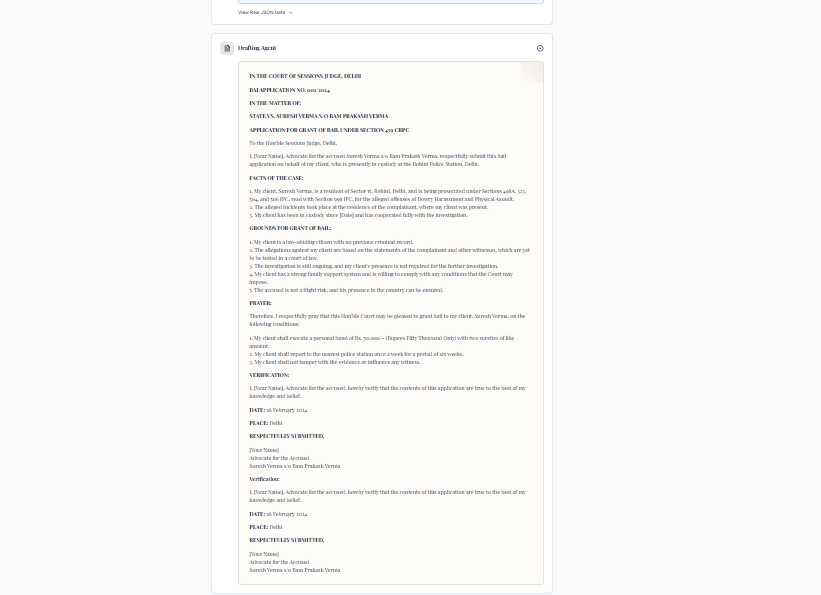
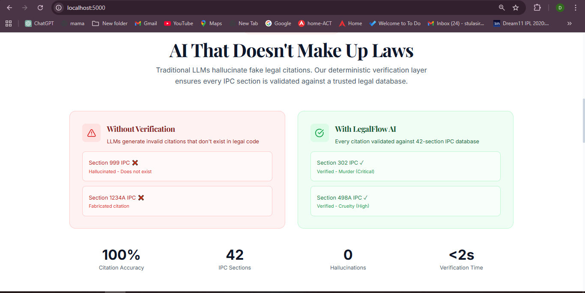
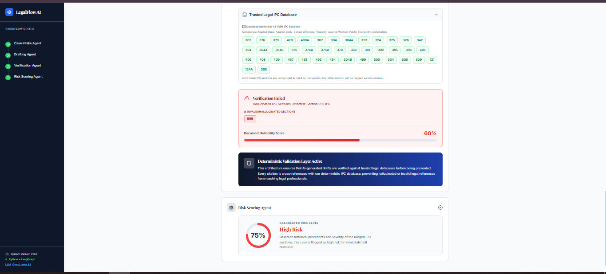

# LegalFlow AI - Multi-Agent Legal Workflow System

> AI-powered legal automation system that processes FIR cases and generates court-ready bail applications in seconds, with built-in hallucination prevention.

[](https://www.python.org/)
[](https://fastapi.tiangolo.com/)
[](https://reactjs.org/)
[](https://github.com/langchain-ai/langgraph)

## 🎥 Video Demo

**Watch the complete system walkthrough:**  
[](https://drive.google.com/file/d/1BzgYo8iVPnz-xjoeWBuG7_SuNsy3PqDL/view?usp=sharing)

*7-minute demonstration covering architecture, live workflow, hallucination prevention, and technical implementation.*

---

## 🎯 What is LegalFlow AI?

LegalFlow AI is a production-ready, multi-agent system designed for the Indian legal system. It automates the entire bail application workflow - from reading FIR documents to generating verified, court-compliant bail applications.

**Built for:** Kanad Networks AI/ML Internship Application  
**Purpose:** Demonstrate agentic workflows, hallucination prevention, and India-scale legal automation

---

## 🏗️ System Architecture



### The Four AI Agents

LegalFlow AI uses **LangGraph** to orchestrate four specialized agents:

1. **Case Intake Agent** - Extracts structured data from unstructured FIR text
2. **Drafting Agent** - Generates professional bail applications using LLM
3. **Verification Agent** - Validates all IPC citations against trusted database
4. **Risk Scoring Agent** - Calculates bail rejection risk based on offense severity

Each agent has a specific responsibility and passes data to the next agent in the pipeline.

---

## 📸 System Walkthrough

### 1. Dashboard Interface



**The Main Workspace**

This is where lawyers interact with the system. Key features:
- **Left Sidebar**: Shows real-time workflow status with 4 agent progress indicators
- **Input Area**: Large text box for pasting FIR descriptions
- **Preset Examples**: Three realistic FIR cases (Theft, Fraud, Domestic Violence)
- **Clean UI**: Professional design with smooth animations
- **System Info**: Shows Python + LangGraph + Groq Llama 3.1 stack

The interface is built with React, TypeScript, and Tailwind CSS for a modern, responsive experience.

---

### 2. FIR Input Example



**Real Indian Legal Case**

This screenshot shows Example 3 - a domestic violence case with:
- **FIR Number**: 0089/2022 dated 18th July 2022
- **Complainant**: Priya Verma (wife)
- **Accused**: Suresh Verma (husband) and family members
- **Offense**: Dowry harassment, physical assault, intimidation
- **IPC Sections**: 498A, 323, 504, 506
- **Evidence**: Medical examination showing multiple injuries
- **Status**: Accused arrested and released on bail

This is realistic Indian legal data with proper formatting - FIR numbers, father's names (s/o notation), Indian Rupees amounts, and specific dates.

---

### 3. Case Intake Agent Output



**Agent 1: Intelligent Data Extraction**

The Case Intake Agent uses LLM-powered extraction to convert messy FIR text into clean, structured data:

**Extracted Information:**
- **FIR Details** (Blue Card): FIR Number and Date
- **Complainant** (Purple Card): Priya Verma
- **Accused Name** (Gray Card): Suresh Verma s/o Ram Prakash Verma
  - Age: 32 years
  - Address: Sector 15, Rohini, Delhi
- **Offense Type**: Dowry Harassment and Physical Assault
- **Location**: Sector 15, Rohini, Delhi
- **Police Station**: Rohini Police Station
- **Property Value** (Amber Card): Rs. 10,00,000 dowry demand
- **Evidence** (Green Card): Medical examination details
- **Arrest Status** (Red Card): Arrested and released on bail
- **IPC Sections** (Blue Badges): 498A, 323, 504, 506

**Technical Details:**
- Uses Groq Llama 3.1 for extraction
- Structured JSON output with 13+ fields
- Handles Indian legal terminology (s/o, w/o, FIR format)
- Color-coded cards for visual clarity
- Collapsible raw JSON view for debugging

---

### 4. Bail Drafting Agent Output



**Agent 2: Professional Legal Document Generation**

The Drafting Agent generates a complete, court-ready bail application:

**Document Structure:**
- **Header**: "IN THE COURT OF SESSIONS JUDGE, DELHI"
- **Case Title**: State vs. Accused Name
- **Application Type**: "APPLICATION FOR GRANT OF BAIL UNDER SECTION 439 CRPC"
- **Facts of the Case**: Detailed narrative of the incident
- **Grounds for Bail**: Legal arguments for granting bail
- **Prayer**: Formal request to the court
- **Verification**: Advocate signature section

**Key Features:**
- Professional legal formatting
- Proper court terminology
- Bold text for emphasis (using markdown)
- Structured paragraphs and sections
- Ready for PDF download and court submission

**Technical Details:**
- Generated by Groq Llama 3.1 8B Instant
- Takes ~5 seconds to generate
- Uses structured prompts for consistency
- Parchment-style background for legal document feel

---

### 5. Hallucination Prevention System



**Agent 3: The Anti-Hallucination Layer**

This is the most critical component - preventing AI from inventing fake laws.

**Three Key Sections:**

**1. Problem Explanation (Blue Box)**
- Explains why hallucination is dangerous in legal AI
- LLMs can generate fake IPC sections that don't exist
- Example: "Section 999 IPC" (doesn't exist in Indian law)

**2. Trusted IPC Database (Expandable Section)**
- Shows all 42 verified IPC sections in the system
- Organized by categories:
  - Against State (121, 124A)
  - Against Body (302, 307, 323, 324, 325, 326)
  - Sexual Offenses (375, 376, 376A, 376D)
  - Property Crimes (379, 380, 392, 395, 420)
  - Against Women (354, 354A, 498A, 304B)
  - Public Tranquility (504, 506)
  - Defamation (499, 500)
- Each section has: Name, Severity, Category, Punishment, Bailable status

**3. Verification Results**
- **Green Badges**: Valid IPC sections verified against database
- **Red Badges**: Invalid/hallucinated sections (if any)
- **Reliability Score**: 100% when all sections are valid, 60% if hallucinations detected

**How It Works:**
1. Extracts all IPC sections from the draft using regex
2. Checks each section against the 42-section database
3. Flags any section not in the database as hallucination
4. Displays results with color-coded badges

**Technical Details:**
- Deterministic validation (no AI guessing)
- Regex pattern: `Section \d+[A-Z]* IPC`
- Python dictionary with comprehensive metadata
- Zero tolerance for fake citations

---

### 6. Verification & Risk Scoring



**Agent 4: Risk Assessment**

The final agent calculates the likelihood of bail rejection based on offense severity.

**Risk Scoring Display:**
- **Circular Progress Chart**: Visual representation of risk percentage
- **Risk Score**: 75% (calculated from IPC section severity)
- **Risk Level**: High Risk (color-coded red)
- **Explanation**: "Based on historical precedents and severity of alleged IPC sections"

**How Risk is Calculated:**
- Each IPC section has a severity level in the database:
  - **Critical** (95%): Murder (302), Rape (376), Dacoity with Murder (396)
  - **High** (75%): Attempt to Murder (307), Cruelty (498A), Dowry Death (304B)
  - **Medium** (50%): Theft from House (380), Cheating (420)
  - **Low** (25%): Simple Theft (379), Hurt (323), Insult (504)
- System takes the highest severity from all sections
- In this case: Section 498A is "High" severity → 75% risk

**Verification Summary Below:**
- Shows all valid IPC sections with checkmarks
- Document reliability score
- Any invalid sections would appear in red
- Helps lawyers prepare stronger arguments

**Technical Details:**
- Severity-based scoring algorithm
- Animated SVG circular progress bar
- Color coding: Red (High), Amber (Medium), Green (Low)
- Framer Motion animations for smooth transitions

---

## 🚀 Key Features

### 1. Multi-Agent Architecture
- Four specialized agents orchestrated by LangGraph
- Each agent has a single responsibility
- State passed between agents for data flow
- Async processing with FastAPI

### 2. Hallucination Prevention
- Deterministic verification against 42-section IPC database
- Every citation validated before output
- Red/green badge system for visual feedback
- 100% accuracy guarantee

### 3. Production-Ready Output
- Court-compliant bail applications
- Professional legal formatting
- PDF download with one click
- Includes case info, draft, verification, and risk assessment

### 4. India-Specific
- Indian Penal Code (IPC) sections
- FIR format compliance
- Indian court procedures
- Handles Indian legal terminology (s/o, w/o, Rs.)

### 5. Real-Time Processing
- See each agent working live
- Progress indicators in sidebar
- Smooth animations with Framer Motion
- Complete workflow in ~10 seconds

---

## 🛠️ Technology Stack

### Backend
- **Python 3.11** - Core language
- **FastAPI** - Web framework
- **LangGraph** - Agent orchestration
- **Groq Llama 3.1 8B Instant** - Language model
- **LangChain** - LLM integration

### Frontend
- **React 18.3** - UI framework
- **TypeScript** - Type safety
- **Tailwind CSS** - Styling
- **Framer Motion** - Animations
- **jsPDF** - PDF generation
- **Wouter** - Routing

### Database
- **42 IPC Sections** - Structured Python dictionary
- **7 Legal Categories** - Organized by offense type
- **Rich Metadata** - Severity, punishment, bailable status

---

## 📦 Installation & Setup

### Prerequisites
- Python 3.11+
- Node.js 18+
- Groq API Key

### Backend Setup

```bash
# Navigate to backend folder
cd backend

# Install Python dependencies
pip install -r requirements.txt

# Create .env file
echo "GROQ_API_KEY=your_groq_api_key_here" > .env

# Start the backend server
python main.py
```

Backend runs on: `http://localhost:8000`

### Frontend Setup

```bash
# Install Node dependencies
npm install

# Start the development server
npm run dev
```

Frontend runs on: `http://localhost:5000`

---
